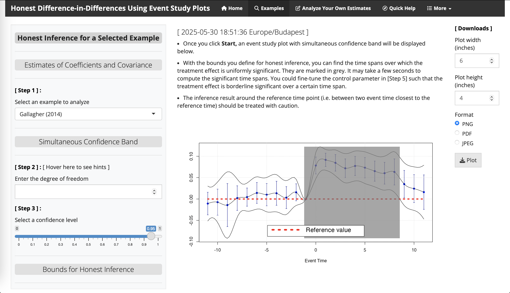

# Making Event Study Plots Honest: A Functional Data Approach to Causal Inference

[](https://makeapullrequest.com)


This is a shiny app that facilitates the honest causal inference approach proposed in Fang and Liebl (2025)[^1] and is built on the R package: [fdid](https://github.com/ccfang2/fdid). Latest Update: 2025-12-15

## About Honest DiD Inference

This is a useful tool when you are uncertain about if no-anticipation and/or parallel trends assumptions hold in your difference-in-differences setting. It provides a novel functional perspective on Difference-in-Differences (DiD) that allows for honest inference using event study plots under violations of parallel trends and/or no-anticipation assumptions.

## Loading the app

There are two ways to use this shiny app, locally and remotely.

1. You could run this shiny app in [RStudio](https://posit.co) locally

```r
# install.packages("shiny") # install Shiny if not installed
library(shiny)
shiny::runGitHub("fdidHonestInference", "ccfang2")
```

2. Alternatively, you can access the online version of this shiny app [here](https://ccfang2.shinyapps.io/fdidHonestInference/). 

## About this app

### Screenshot


### What does this app do for you
1. Honest inference for some example papers and simulation data.
2. Honest inference for your own data, if you already have estimated event-study coefficients and covariance matrix.
3. DiD estimation using functional TWFE model as presented in Fang and Liebl (2025)[^1], if you haven't got estimated event-study coefficients and covariance matrix yet.

### Features
1. No need to install or configurate anything before using this app. This is user-friendly to non-R users. But it is highly recommended to read Fang and Liebl (2025)[^1] beforehand, so you will know all the terms that appear on the app.
2. Analysis results and plots are downloadable by a simple click of button. But, please be reminded that only the latest analysis results and plots are accessible, so please download them timely if needed.

### Instructions
Please watch this Youtube [video](https://www.youtube.com/watch?v=tUGmDLJE9qA) for detailed instruction. This video is also embeded in this Shiny app. Please be aware that the layout of Shiny app shown in this video may be slightly different from the latest version of app.

## Reference
[^1]: Fang, C. and Liebl, D. (2025). Making Event Study Plots Honest: A Functional Data Approach to Causal Inference. [arXiv:2512.06804](https://arxiv.org/abs/2512.06804).

## Contact
I hope you enjoy using this app. Any comments or questions are welcome at [ccfang[at]uni-bonn.de](mailto:ccfang@uni-bonn.de).
